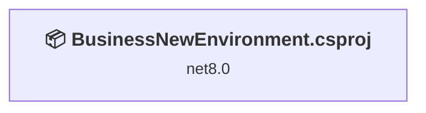
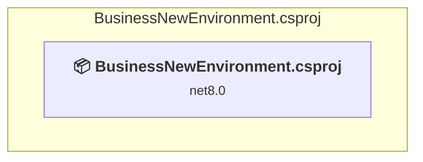

# Projects and dependencies analysis

This document provides a comprehensive overview of the projects and their dependencies in the context of upgrading to .NETCoreApp,Version=v10.0.

## Table of Contents

- [Executive Summary](#executive-Summary)
  - [Highlevel Metrics](#highlevel-metrics)
  - [Projects Compatibility](#projects-compatibility)
  - [Package Compatibility](#package-compatibility)
  - [API Compatibility](#api-compatibility)
  - [Binding Redirect Configuration](#binding-redirect-configuration)
- [Aggregate NuGet packages details](#aggregate-nuget-packages-details)
- [Top API Migration Challenges](#top-api-migration-challenges)
  - [Technologies and Features](#technologies-and-features)
  - [Most Frequent API Issues](#most-frequent-api-issues)
- [Projects Relationship Graph](#projects-relationship-graph)
- [Project Details](#project-details)

  - [BusinessNewEnvironment\BusinessNewEnvironment.csproj](#businessnewenvironmentbusinessnewenvironmentcsproj)

## Executive Summary

### Highlevel Metrics

| Metric | Count | Status |
| :--- | :---: | :--- |
| Total Projects | 1 | All require upgrade |
| Total NuGet Packages | 55 | 3 need upgrade |
| Total Code Files | 28 |  |
| Total Code Files with Incidents | 6 |  |
| Total Lines of Code | 2350 |  |
| Total Number of Issues | 41 |  |
| Estimated LOC to modify | 37+ | at least 1.6% of codebase |

### Projects Compatibility

| Project | Target Framework | Difficulty | Package Issues | API Issues | Binding Issues | Est. LOC Impact | Description |
| :--- | :---: | :---: | :---: | :---: | :---: | :---: | :--- |
| [BusinessNewEnvironment\BusinessNewEnvironment.csproj](#businessnewenvironmentbusinessnewenvironmentcsproj) | net8.0 | 🟡 Medium | 3 | 37 | 0 | 37+ | AspNetCore, Sdk Style = True |

### Package Compatibility

| Status | Count | Percentage |
| :--- | :---: | :---: |
| ✅ Compatible | 52 | 94.5% |
| ⚠️ Incompatible | 1 | 1.8% |
| 🔄 Upgrade Recommended | 2 | 3.6% |
| ***Total NuGet Packages*** | ***55*** | ***100%*** |

### API Compatibility

| Category | Count | Impact |
| :--- | :---: | :--- |
| 🔴 Binary Incompatible | 35 | High - Require code changes |
| 🟡 Source Incompatible | 1 | Medium - Needs re-compilation and potential conflicting API error fixing |
| 🔵 Behavioral change | 1 | Low - Behavioral changes that may require testing at runtime |
| ✅ Compatible | 3066 |  |
| ***Total APIs Analyzed*** | ***3103*** |  |

## Aggregate NuGet packages details

| Package | Current Version | Suggested Version | Projects | Description |
| :--- | :---: | :---: | :--- | :--- |
| BCrypt.Net-Next | 4.0.3 |  | [BusinessNewEnvironment.csproj](#businessnewenvironmentbusinessnewenvironmentcsproj) | ✅Compatible |
| Humanizer.Core | 2.14.1 |  | [BusinessNewEnvironment.csproj](#businessnewenvironmentbusinessnewenvironmentcsproj) | ✅Compatible |
| Microsoft.Bcl.AsyncInterfaces | 6.0.0 |  | [BusinessNewEnvironment.csproj](#businessnewenvironmentbusinessnewenvironmentcsproj) | ✅Compatible |
| Microsoft.Bcl.Memory | 9.0.0 |  | [BusinessNewEnvironment.csproj](#businessnewenvironmentbusinessnewenvironmentcsproj) | ✅Compatible |
| Microsoft.CodeAnalysis.Analyzers | 3.3.3 |  | [BusinessNewEnvironment.csproj](#businessnewenvironmentbusinessnewenvironmentcsproj) | ✅Compatible |
| Microsoft.CodeAnalysis.Common | 4.5.0 |  | [BusinessNewEnvironment.csproj](#businessnewenvironmentbusinessnewenvironmentcsproj) | ✅Compatible |
| Microsoft.CodeAnalysis.CSharp | 4.5.0 |  | [BusinessNewEnvironment.csproj](#businessnewenvironmentbusinessnewenvironmentcsproj) | ✅Compatible |
| Microsoft.CodeAnalysis.CSharp.Workspaces | 4.5.0 |  | [BusinessNewEnvironment.csproj](#businessnewenvironmentbusinessnewenvironmentcsproj) | ✅Compatible |
| Microsoft.CodeAnalysis.Workspaces.Common | 4.5.0 |  | [BusinessNewEnvironment.csproj](#businessnewenvironmentbusinessnewenvironmentcsproj) | ✅Compatible |
| Microsoft.EntityFrameworkCore | 8.0.0 | 10.0.12 | [BusinessNewEnvironment.csproj](#businessnewenvironmentbusinessnewenvironmentcsproj) | NuGet package upgrade is recommended |
| Microsoft.EntityFrameworkCore.Abstractions | 8.0.0 |  | [BusinessNewEnvironment.csproj](#businessnewenvironmentbusinessnewenvironmentcsproj) | ✅Compatible |
| Microsoft.EntityFrameworkCore.Analyzers | 8.0.0 |  | [BusinessNewEnvironment.csproj](#businessnewenvironmentbusinessnewenvironmentcsproj) | ✅Compatible |
| Microsoft.EntityFrameworkCore.Design | 8.0.0 |  | [BusinessNewEnvironment.csproj](#businessnewenvironmentbusinessnewenvironmentcsproj) | ✅Compatible |
| Microsoft.EntityFrameworkCore.Relational | 8.0.0 |  | [BusinessNewEnvironment.csproj](#businessnewenvironmentbusinessnewenvironmentcsproj) | ✅Compatible |
| Microsoft.EntityFrameworkCore.Tools | 8.0.0 | 10.0.12 | [BusinessNewEnvironment.csproj](#businessnewenvironmentbusinessnewenvironmentcsproj) | NuGet package upgrade is recommended |
| Microsoft.Extensions.ApiDescription.Server | 6.0.5 |  | [BusinessNewEnvironment.csproj](#businessnewenvironmentbusinessnewenvironmentcsproj) | ✅Compatible |
| Microsoft.Extensions.Caching.Abstractions | 8.0.0 |  | [BusinessNewEnvironment.csproj](#businessnewenvironmentbusinessnewenvironmentcsproj) | ✅Compatible |
| Microsoft.Extensions.Caching.Memory | 8.0.0 |  | [BusinessNewEnvironment.csproj](#businessnewenvironmentbusinessnewenvironmentcsproj) | ✅Compatible |
| Microsoft.Extensions.Configuration.Abstractions | 8.0.0 |  | [BusinessNewEnvironment.csproj](#businessnewenvironmentbusinessnewenvironmentcsproj) | ✅Compatible |
| Microsoft.Extensions.DependencyInjection | 8.0.0 |  | [BusinessNewEnvironment.csproj](#businessnewenvironmentbusinessnewenvironmentcsproj) | ✅Compatible |
| Microsoft.Extensions.DependencyInjection.Abstractions | 8.0.0 |  | [BusinessNewEnvironment.csproj](#businessnewenvironmentbusinessnewenvironmentcsproj) | ✅Compatible |
| Microsoft.Extensions.DependencyModel | 8.0.0 |  | [BusinessNewEnvironment.csproj](#businessnewenvironmentbusinessnewenvironmentcsproj) | ✅Compatible |
| Microsoft.Extensions.Logging | 8.0.0 |  | [BusinessNewEnvironment.csproj](#businessnewenvironmentbusinessnewenvironmentcsproj) | ✅Compatible |
| Microsoft.Extensions.Logging.Abstractions | 8.0.0 |  | [BusinessNewEnvironment.csproj](#businessnewenvironmentbusinessnewenvironmentcsproj) | ✅Compatible |
| Microsoft.Extensions.Options | 8.0.0 |  | [BusinessNewEnvironment.csproj](#businessnewenvironmentbusinessnewenvironmentcsproj) | ✅Compatible |
| Microsoft.Extensions.Primitives | 8.0.0 |  | [BusinessNewEnvironment.csproj](#businessnewenvironmentbusinessnewenvironmentcsproj) | ✅Compatible |
| Microsoft.IdentityModel.Abstractions | 8.6.0 |  | [BusinessNewEnvironment.csproj](#businessnewenvironmentbusinessnewenvironmentcsproj) | ✅Compatible |
| Microsoft.IdentityModel.JsonWebTokens | 8.6.0 |  | [BusinessNewEnvironment.csproj](#businessnewenvironmentbusinessnewenvironmentcsproj) | ✅Compatible |
| Microsoft.IdentityModel.Logging | 8.6.0 |  | [BusinessNewEnvironment.csproj](#businessnewenvironmentbusinessnewenvironmentcsproj) | ✅Compatible |
| Microsoft.IdentityModel.Tokens | 8.6.0 |  | [BusinessNewEnvironment.csproj](#businessnewenvironmentbusinessnewenvironmentcsproj) | ✅Compatible |
| Microsoft.OpenApi | 1.6.14 |  | [BusinessNewEnvironment.csproj](#businessnewenvironmentbusinessnewenvironmentcsproj) | ✅Compatible |
| Microsoft.VisualStudio.Azure.Containers.Tools.Targets | 1.21.0 |  | [BusinessNewEnvironment.csproj](#businessnewenvironmentbusinessnewenvironmentcsproj) | ⚠️NuGet package is incompatible |
| Mono.TextTemplating | 2.2.1 |  | [BusinessNewEnvironment.csproj](#businessnewenvironmentbusinessnewenvironmentcsproj) | ✅Compatible |
| Npgsql | 8.0.0 |  | [BusinessNewEnvironment.csproj](#businessnewenvironmentbusinessnewenvironmentcsproj) | ✅Compatible |
| Npgsql.EntityFrameworkCore.PostgreSQL | 8.0.0 |  | [BusinessNewEnvironment.csproj](#businessnewenvironmentbusinessnewenvironmentcsproj) | ✅Compatible |
| Swashbuckle.AspNetCore | 6.6.2 |  | [BusinessNewEnvironment.csproj](#businessnewenvironmentbusinessnewenvironmentcsproj) | ✅Compatible |
| Swashbuckle.AspNetCore.Swagger | 6.6.2 |  | [BusinessNewEnvironment.csproj](#businessnewenvironmentbusinessnewenvironmentcsproj) | ✅Compatible |
| Swashbuckle.AspNetCore.SwaggerGen | 6.6.2 |  | [BusinessNewEnvironment.csproj](#businessnewenvironmentbusinessnewenvironmentcsproj) | ✅Compatible |
| Swashbuckle.AspNetCore.SwaggerUI | 6.6.2 |  | [BusinessNewEnvironment.csproj](#businessnewenvironmentbusinessnewenvironmentcsproj) | ✅Compatible |
| System.CodeDom | 4.4.0 |  | [BusinessNewEnvironment.csproj](#businessnewenvironmentbusinessnewenvironmentcsproj) | ✅Compatible |
| System.Collections.Immutable | 6.0.0 |  | [BusinessNewEnvironment.csproj](#businessnewenvironmentbusinessnewenvironmentcsproj) | ✅Compatible |
| System.Composition | 6.0.0 |  | [BusinessNewEnvironment.csproj](#businessnewenvironmentbusinessnewenvironmentcsproj) | ✅Compatible |
| System.Composition.AttributedModel | 6.0.0 |  | [BusinessNewEnvironment.csproj](#businessnewenvironmentbusinessnewenvironmentcsproj) | ✅Compatible |
| System.Composition.Convention | 6.0.0 |  | [BusinessNewEnvironment.csproj](#businessnewenvironmentbusinessnewenvironmentcsproj) | ✅Compatible |
| System.Composition.Hosting | 6.0.0 |  | [BusinessNewEnvironment.csproj](#businessnewenvironmentbusinessnewenvironmentcsproj) | ✅Compatible |
| System.Composition.Runtime | 6.0.0 |  | [BusinessNewEnvironment.csproj](#businessnewenvironmentbusinessnewenvironmentcsproj) | ✅Compatible |
| System.Composition.TypedParts | 6.0.0 |  | [BusinessNewEnvironment.csproj](#businessnewenvironmentbusinessnewenvironmentcsproj) | ✅Compatible |
| System.IdentityModel.Tokens.Jwt | 8.6.0 |  | [BusinessNewEnvironment.csproj](#businessnewenvironmentbusinessnewenvironmentcsproj) | ✅Compatible |
| System.IO.Pipelines | 6.0.3 |  | [BusinessNewEnvironment.csproj](#businessnewenvironmentbusinessnewenvironmentcsproj) | ✅Compatible |
| System.Reflection.Metadata | 6.0.1 |  | [BusinessNewEnvironment.csproj](#businessnewenvironmentbusinessnewenvironmentcsproj) | ✅Compatible |
| System.Runtime.CompilerServices.Unsafe | 6.0.0 |  | [BusinessNewEnvironment.csproj](#businessnewenvironmentbusinessnewenvironmentcsproj) | ✅Compatible |
| System.Text.Encoding.CodePages | 6.0.0 |  | [BusinessNewEnvironment.csproj](#businessnewenvironmentbusinessnewenvironmentcsproj) | ✅Compatible |
| System.Text.Encodings.Web | 8.0.0 |  | [BusinessNewEnvironment.csproj](#businessnewenvironmentbusinessnewenvironmentcsproj) | ✅Compatible |
| System.Text.Json | 8.0.0 |  | [BusinessNewEnvironment.csproj](#businessnewenvironmentbusinessnewenvironmentcsproj) | ✅Compatible |
| System.Threading.Channels | 6.0.0 |  | [BusinessNewEnvironment.csproj](#businessnewenvironmentbusinessnewenvironmentcsproj) | ✅Compatible |

## Top API Migration Challenges

### Technologies and Features

| Technology | Issues | Percentage | Migration Path |
| :--- | :---: | :---: | :--- |
| IdentityModel & Claims-based Security | 35 | 94.6% | Windows Identity Foundation (WIF), SAML, and claims-based authentication APIs that have been replaced by modern identity libraries. WIF was the original identity framework for .NET Framework. Migrate to Microsoft.IdentityModel.* packages (modern identity stack). |
| Legacy Cryptography | 1 | 2.7% | Obsolete or insecure cryptographic algorithms that have been deprecated for security reasons. These algorithms are no longer considered secure by modern standards. Migrate to modern cryptographic APIs using secure algorithms. |

### Most Frequent API Issues

| API | Count | Percentage | Category |
| :--- | :---: | :---: | :--- |
| T:System.IdentityModel.Tokens.Jwt.JwtSecurityTokenHandler | 7 | 18.9% | Binary Incompatible |
| M:System.IdentityModel.Tokens.Jwt.JwtSecurityTokenHandler.#ctor | 7 | 18.9% | Binary Incompatible |
| M:System.IdentityModel.Tokens.Jwt.JwtSecurityTokenHandler.WriteToken(Microsoft.IdentityModel.Tokens.SecurityToken) | 5 | 13.5% | Binary Incompatible |
| T:System.IdentityModel.Tokens.Jwt.JwtSecurityToken | 5 | 13.5% | Binary Incompatible |
| M:System.IdentityModel.Tokens.Jwt.JwtSecurityToken.#ctor(System.String,System.String,System.Collections.Generic.IEnumerable{System.Security.Claims.Claim},System.Nullable{System.DateTime},System.Nullable{System.DateTime},Microsoft.IdentityModel.Tokens.SigningCredentials) | 5 | 13.5% | Binary Incompatible |
| P:System.IdentityModel.Tokens.Jwt.JwtSecurityToken.Claims | 4 | 10.8% | Binary Incompatible |
| M:System.IdentityModel.Tokens.Jwt.JwtSecurityTokenHandler.ValidateToken(System.String,Microsoft.IdentityModel.Tokens.TokenValidationParameters,Microsoft.IdentityModel.Tokens.SecurityToken@) | 2 | 5.4% | Binary Incompatible |
| T:System.Security.Cryptography.RNGCryptoServiceProvider | 1 | 2.7% | Source Incompatible |
| M:Microsoft.Extensions.DependencyInjection.HttpClientFactoryServiceCollectionExtensions.AddHttpClient(Microsoft.Extensions.DependencyInjection.IServiceCollection) | 1 | 2.7% | Behavioral Change |

## Projects Relationship Graph

Legend:
📦 SDK-style project
⚙️ Classic project

## Project Details

### BusinessNewEnvironment\BusinessNewEnvironment.csproj

#### Project Info

- **Current Target Framework:** net8.0
- **Proposed Target Framework:** net10.0
- **SDK-style**: True
- **Project Kind:** AspNetCore
- **Dependencies**: 0
- **Dependants**: 0
- **Number of Files**: 60
- **Number of Files with Incidents**: 6
- **Lines of Code**: 2350
- **Estimated LOC to modify**: 37+ (at least 1.6% of the project)

#### Dependency Graph

Legend:
📦 SDK-style project
⚙️ Classic project

### API Compatibility

| Category | Count | Impact |
| :--- | :---: | :--- |
| 🔴 Binary Incompatible | 35 | High - Require code changes |
| 🟡 Source Incompatible | 1 | Medium - Needs re-compilation and potential conflicting API error fixing |
| 🔵 Behavioral change | 1 | Low - Behavioral changes that may require testing at runtime |
| ✅ Compatible | 3066 |  |
| ***Total APIs Analyzed*** | ***3103*** |  |

#### Project Technologies and Features

| Technology | Issues | Percentage | Migration Path |
| :--- | :---: | :---: | :--- |
| IdentityModel & Claims-based Security | 35 | 94.6% | Windows Identity Foundation (WIF), SAML, and claims-based authentication APIs that have been replaced by modern identity libraries. WIF was the original identity framework for .NET Framework. Migrate to Microsoft.IdentityModel.* packages (modern identity stack). |
| Legacy Cryptography | 1 | 2.7% | Obsolete or insecure cryptographic algorithms that have been deprecated for security reasons. These algorithms are no longer considered secure by modern standards. Migrate to modern cryptographic APIs using secure algorithms. |

